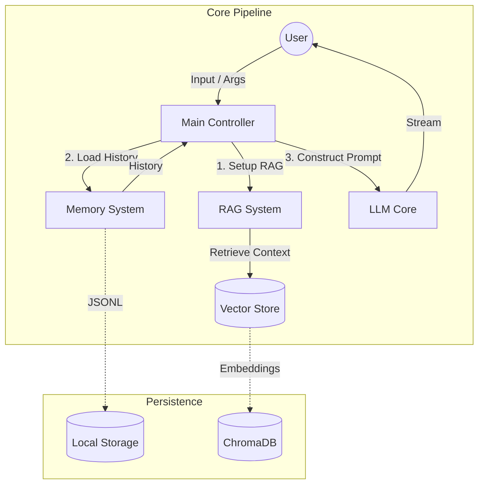

# Vagus Architecture

This document outlines the high-level architecture and data flow of Vagus (v0.2.2).

## Core Flow

Vagus operates as a pipeline that connects user input to a Large Language Model (LLM), manages context via persistent memory, and optionally retrieves information from local documents (RAG).

### High-Level Diagram

## Key Components

1.  **Main Controller (`src/vagus/main.py`):**
    *   **Orchestrator:** Parses CLI args (`--session`, `--rag`, `--debug`), combines stdin/args, and initializes the pipeline.
    *   **Error Handling:** Wraps execution to handle interruptions and API errors gracefully (or prints tracebacks in `--debug` mode).

2.  **Memory System (`src/vagus/memory/storage.py`):**
    *   **Persistence:** Stores conversation history in JSONL format at `~/.vagus/sessions/`.
    *   **Context Window:** Loads the last `N` interactions to maintain conversation continuity.

3.  **RAG System (Retrieval-Augmented Generation):**
    *   **Ingestion (`utils/pdf_ingestor.py`):** Extracts text from PDFs and chunks it.
    *   **Storage (`memory/vector_store.py`):** Embeds chunks using `sentence-transformers` and stores them in ChromaDB (`~/.vagus/vector_db`).
    *   **Retrieval:** Finds the top 3 most relevant chunks to inject into the LLM prompt.

4.  **LLM Core (`src/vagus/core/llm.py`):**
    *   **Inference:** Wraps `litellm` to support unified API calls to various providers (OpenAI, Gemini, Claude).
    *   **Streaming:** Manages real-time token streaming to `stdout`.

5.  **Testing Infrastructure (`tests/`):**
    *   **Unit Tests:** `pytest` suite covering core logic (LLM mocking, Storage I/O).
    *   **CI:** GitHub Actions pipeline ensuring build stability.
